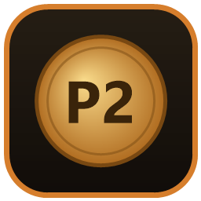

<p align="center">
  
</p>

# POE2 Currency Overlay

A hotkey overlay for **Path of Exile 2**: live currency exchange rates and arbitrage, an item price checker, and a Desecrate (Omen of Light) EV calculator. Press a hotkey, it appears over the game; press it again and it's gone.

Windows, built with Electron. It reads public data only — no game memory hooks, no automation, nothing that touches the game client.

**[Download & screenshots →](https://poe2-vibetools.github.io/poe2-currency-overlay/)**

## What it does

### Currency (F6)

- Live exchange rates from GGG's official Currency Exchange data, with the live trade-site order book on top for the pairs on screen.
- **Buckets** — a currency you want to buy, priced in every currency you'd pay with. A green **BEST** badge marks the cheapest way to pay; the other rows show how much more they cost.
- **Arbitrage routes** — a green **arb %** flags a profitable 3-trade loop from that row. Hover for the route step by step, pin it, copy it to chat.
- **7-day sparklines** with hoverable per-day history; type your own rate to override any pair.

### Price Check (Ctrl+F, or Ctrl+Alt+F for a quick check)

- Hover an item in game, press the hotkey, and it's parsed, filtered, and priced against live trade listings.
- Prices the item by its stats, not its exact mod text: fungible added-damage rolls match across elements, resistances fold into a pseudo total, weapons price on total DPS, and catalyst quality and Runic Ward are read correctly.
- Item level, quality and augmentable sockets are header range filters, pre-filled from your item.
- A **suggested floor** anchored on the cheapest genuine comparable (for weapons, scaled by how your DPS compares), so an outlier listing doesn't set your price.
- Hover any result to compare it to your item line by line, with quality, defence, resistance and socket totals beside yours.

### Desecrate — Omen of Light EV

- From a price-checked item with a desecrated mod, click **redesecrate?** in its corner — or paste any item onto the Desecrate tab.
- Pick the mods you'd keep and the worst tier you'd accept; each is weighted by its real spawn chance.
- It prices your item as it stands and with a hit, autofills consumable costs from live rates, and compares the routes (Preserved / Ancient / Altered) to a per-route EV and a plain verdict.

## Install

**Most people:** download the installer from the [website](https://poe2-vibetools.github.io/poe2-currency-overlay/) or the [releases page](https://github.com/POE2-VibeTools/poe2-currency-overlay/releases). Windows only. The build is unsigned, so if SmartScreen appears, choose **More info → Run anyway**.

**From source:**

```bash
git clone https://github.com/POE2-VibeTools/poe2-currency-overlay
cd poe2-currency-overlay
npm install
npm start
```

## Usage

- **F6** — toggle the currency overlay. **Ctrl+F** — price-check the hovered item (**Ctrl+Alt+F** hides itself once you mouse away). **Esc** — hide. All hotkeys are rebindable in Settings.
- Copy an item with **Ctrl+C** and paste it onto the Price Check or Desecrate tab to work from outside the game.
- The game must be in **Windowed** or **Windowed Fullscreen** — exclusive fullscreen hides any overlay.

## Data sources

Currency rates come from GGG's official Currency Exchange data (real executed trades), topped with the live trade-site order book for the pairs on screen. Item price checks search the official trade site. [poe2scout.com](https://poe2scout.com) supplies item icons, price history, and fallback rates.

## Credits

The item price-checking is built on the [Exiled Exchange 2](https://github.com/Kvan7/Exiled-Exchange-2) matching engine (a fork of Awakened PoE Trade). Thanks to the EE2 / APT maintainers and everyone who keeps the stat and item resource data up to date.

## License

GPL-3.0 — see [LICENSE](LICENSE). The vendored Exiled Exchange 2 item parser keeps its own MIT license (`renderer/vendor/ee2/LICENSE`).

---

Not affiliated with Grinding Gear Games.
